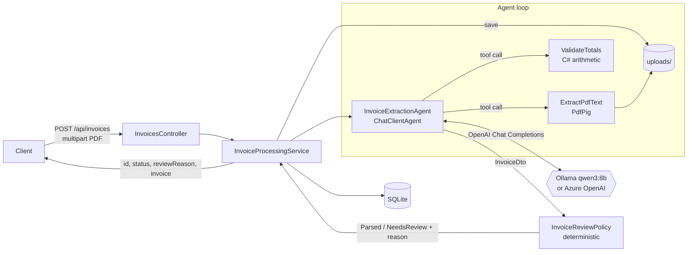

# Invoice Agent

An AI agent that turns PDF invoices of any layout and language into structured JSON, built on
**Microsoft Agent Framework** and **.NET 10**. It runs fully locally on Ollama (`qwen3:8b`) and switches to
Azure OpenAI / Azure AI Foundry with a config change.

What it demonstrates:

- **Agent + tool calling:** the agent reads the PDF and checks its own arithmetic through tools.
- **Structured output:** the final answer is a typed `InvoiceDto`, constrained by a JSON schema.
- **Deterministic validation:** C# code, not the model, decides whether a result can be trusted.
- **Human-in-the-loop status:** `Parsed` or `NeedsReview` with a concrete reason.
- **Evals:** field-level accuracy against hand-written ground truth, run as an xUnit test.
- **Per-call observability:** provider, model, tokens, latency, tool calls and final status, logged for every run.

## Architecture



The API and the evals share `InvoiceProcessingService`, so the eval measures exactly the production code path.

| Folder | Contents |
|---|---|
| `src/InvoiceAgent.Api/Agents` | agent, provider factory, review policy, processing pipeline |
| `src/InvoiceAgent.Api/Tools` | PDF store and text extraction, `ValidateTotals`, amount grounding |
| `src/InvoiceAgent.Api/Models` | `InvoiceDto` (its `[Description]`s become the JSON schema) |
| `src/InvoiceAgent.Api/Data` | EF Core + SQLite |
| `tests/InvoiceAgent.Evals` | end-to-end eval + 31 deterministic tests |
| `samples/invoices` | 6 PDFs, their HTML sources and `*.expected.json` |

## How the agent loop works

One request is **two turns in one `AgentSession`**:

1. **Agentic turn (no response format).**
   - The model calls `ExtractPdfText(fileId)`. It gets page text in which table cells are separated by ` | `.
   - It passes the amounts it read to `ValidateTotals`. The tool checks `quantity × unitPrice = amount` for each line, `Σ lines = subtotal`, and `Σ lines + tax − discount = total`, all within 0.01.
   - On a mismatch the model re-reads the text and tries again, up to 3 checks.
2. **Formatting turn.** `agent.RunAsync<InvoiceDto>()` asks for the final answer under the JSON schema. The model only formats what is already in the conversation.

Why two turns: with the schema set from the first turn, Ollama constrains *every* turn to the schema, so the model
cannot emit a tool call. On the very first run it skipped the PDF and invented a complete invoice ("ACME Corp,
Widget X"). Splitting the turns keeps tool calling free and still gives a schema-guaranteed final object.

Other settings that mattered, all found by running the pipeline:

| Setting | Why |
|---|---|
| `Reasoning = ReasoningEffort.None` (Ollama only) | qwen3 "thinks" by default: 105 s → 11 s per invoice, with no loss in accuracy. `/no_think` in the prompt did not disable it. |
| `Temperature = 0` | At default temperature one run dropped two digits from a VAT ID. |
| Typed numeric parameters on `ValidateTotals` | The first version took an `invoiceJson` string. The model sent `"27" IPS Monitor"` unescaped three times in a row and invented field names (`qty`, `net`). A typed signature gives the tool call its own JSON schema and has no strings to break. |
| Column-aware text extraction | Plain PdfPig text turned a row into `1 8 500,00 8 500,00`. Is that 1 × 8 500 or 18 × 500? The model read unitPrice 500. |
| Short `fileId`s, validated by regex | The model once mistyped a 32-character GUID. The id comes from the LLM, so it is never used as a raw path. |
| `MaxOutputTokens`, run timeout, 3-check budget | A small model can loop or run away; each case ends as `NeedsReview` instead of hanging. |

## Why validation is deterministic code, not the LLM

The model is good at *reading*. It is not a reliable judge of its own output. These two cases happened during
development, and both are now covered by unit tests:

- **It bends numbers to pass the check.** On the Ukrainian invoice the line check reported
  `quantity 1 × unitPrice 500 = 500, but amount is 8500`. The prompt says "never change numbers just to make
  the check pass". The model still changed quantity to 8, amount to 4000, subtotal to 9200 and total to 11940.
  After that, the arithmetic agreed and `ValidateTotals` said *ok*.
- **It fills gaps.** A receipt that prints only `TOTAL CHF 18.50` came back with `subtotal 18.50, tax 0.00,
  discount 0.00`, which made the totals check pass.

So the final status comes from `InvoiceReviewPolicy`, which the model cannot influence. A result is `Parsed` only
if all of these hold:

1. the agent actually called `ExtractPdfText` (the output is grounded in the document);
2. required fields are present: vendorName, invoiceNumber, invoiceDate, currency, total;
3. dates are `yyyy-MM-dd` and currency is an ISO 4217 code;
4. **every reported amount literally appears in the PDF text** (`AmountGrounding`, locale-aware:
   `1.558,78`, `1,558.78`, `13 700,00`). This check caught both cases above:
   `amounts not found in the document text: subtotal 9200.00, total 11940.00`;
5. the totals check passes.

Otherwise the result is `NeedsReview` with the reason. Code decides what the model cannot be trusted to decide,
and a person looks at the rest.

## Running it

Prerequisites: .NET 10 SDK, [Ollama](https://ollama.com), and about 6.5 GB of VRAM for `qwen3:8b`.

```powershell
ollama pull qwen3:8b

# Ollama's default context is 4096 tokens and it silently truncates beyond that.
# The 18-line invoice needs ~3.3k tokens per request; 8192 leaves headroom and still fits an 8 GB GPU.
[Environment]::SetEnvironmentVariable('OLLAMA_CONTEXT_LENGTH', '8192', 'User')
# then quit Ollama from the tray and start it again
```

Check it with `ollama ps`: you should see `CONTEXT 8192` and `100% GPU`. If part of the model spills to the CPU,
it runs about 4× slower.

```powershell
dotnet run --project src/InvoiceAgent.Api --launch-profile http
```

Swagger UI: http://localhost:5185/swagger

```bash
curl -F "file=@samples/invoices/02-de-rechnung.pdf" http://localhost:5185/api/invoices
```

```json
{
  "id": "066c4a87-565d-407b-b99a-671e31fb495d",
  "status": "Parsed",
  "reviewReason": null,
  "invoice": {
    "vendorName": "Müller Webdesign GmbH", "vendorTaxId": "DE287654321",
    "invoiceNumber": "RE-2026-0147", "invoiceDate": "2026-08-15", "dueDate": "2026-09-14",
    "currency": "EUR",
    "lineItems": [
      { "description": "Webentwicklung (Stunden)", "quantity": 12, "unitPrice": 85.00, "amount": 1020.00 },
      { "description": "Hosting-Paket Business (12 Monate)", "quantity": 1, "unitPrice": 240.00, "amount": 240.00 },
      { "description": "SSL-Zertifikat", "quantity": 1, "unitPrice": 49.90, "amount": 49.90 }
    ],
    "subtotal": 1309.90, "taxAmount": 248.88, "discountAmount": null, "total": 1558.78
  }
}
```

`GET /api/invoices/{id}` returns the stored record, including telemetry, the raw JSON and the extracted PDF text.

Every run writes one log line to the console and to `logs/invoice-agent-<date>.log`:

```
Tool ExtractPdfText -> 1564 chars
Tool ValidateTotals -> mismatch: sum of line items 5826.85 != subtotal 4817.85
Tool ValidateTotals -> ok: lines 5826.85 + tax 1165.37 - discount 0.00 = total 6992.22
Agent run 10d29590… 04-uk-multipage.pdf: Ollama/qwen3:8b, tokens in=9110 out=1594, latency=137923 ms,
  tools=[ExtractPdfText,ValidateTotals,ValidateTotals], status=Parsed, reason=null
```

The mismatch above shows the self-correction loop at work. The model first took "Carried forward: £4,817.85"
from the bottom of page 1 as the subtotal.

### Tests and evals

```powershell
dotnet test
```

This runs 31 deterministic tests: review policy, totals, grounding, and sample integrity. The integrity tests
check that every `expected.json` is arithmetically consistent and matches its PDF. It also runs the end-to-end
eval, which sends every `samples/invoices/*.pdf` through the real pipeline. If Ollama is not reachable or the
model is not pulled, the eval is **skipped** with the commands to fix it. The results table is written to
`eval-report.md`; add `--logger "console;verbosity=detailed"` to also print it.

Scoring rules:
- strings, dates and currency must match exactly (trimmed, case-insensitive);
- amounts must match within 0.01;
- the line-item count must match, and then each line's amount is compared;
- the test passes at ≥ 80% overall field accuracy.

To regenerate the sample PDFs from their HTML sources with headless Edge, run `samples/build-pdfs.ps1`.

## Eval results

`qwen3:8b` on Ollama 0.34.4, RTX 3060 Ti 8 GB, context 8192. Two consecutive runs gave identical results
(2 m 31 s and 2 m 47 s in total):

| Sample | What it tests | Status | Fields correct | Latency |
|---|---|---|---|---|
| 01-ua-fop | Ukrainian ФОП, ЄДРПОУ, UAH, ПДВ 20%, textual date "3 вересня 2026 р." | Parsed | 13/14 | 21 s |
| 02-de-rechnung | German, `1.558,78 €`, MwSt 19% | Parsed | 14/14 | 16 s |
| 03-us-invoice | US, Bill To / Ship To, sales tax 8.875%, "September 12, 2026" | Parsed | 14/14 | 15 s |
| 04-uk-multipage | 2 pages, 18 lines, carried-forward subtotal, dd/MM/yyyy, GBP | Parsed | 29/29 | 65 s |
| 05-pl-discount-shipping | Polish, 5% discount line, courier shipping as a line, VAT 23% | Parsed | 15/15 | 21 s |
| 06-ch-receipt | Receipt with only a total, CHF | **NeedsReview** | 11/11 | 10 s |

**Overall field accuracy: 96/97 = 99.0%.**

- **The receipt goes to review by design.** It has no lines and no subtotal, so its total cannot be verified. Its fields are still extracted correctly.
- **The one miss is a genuine ambiguity.** A Ukrainian ФОП that pays VAT prints two identifiers: РНОКПП `3124509876` and the VAT ІПН `312450926547`. The model picked the VAT number. I left the prompt as it is rather than tune it to this sample.
- **Six invoices is a smoke test, not a benchmark.** See the roadmap.

For reference, the first end-to-end run of all six samples scored 69–86% and varied from run to run. Most of the
gap was closed by the code changes in the tables above, not by prompt tweaks.

## Switching to Azure OpenAI / Azure AI Foundry

Both providers use the same `OpenAI.Chat.ChatClient` → `AsAIAgent()` code path. Only the endpoint and the key change.

```powershell
cd src/InvoiceAgent.Api
dotnet user-secrets set "Ai:Provider" "AzureOpenAI"
dotnet user-secrets set "Ai:AzureOpenAI:Endpoint" "https://<resource>.openai.azure.com/"
dotnet user-secrets set "Ai:AzureOpenAI:Deployment" "gpt-4o-mini"
dotnet user-secrets set "Ai:AzureOpenAI:ApiKey" "<key>"
```

- **Endpoint.** A Foundry resource endpoint (`https://<resource>.services.ai.azure.com/`) works the same way. `/openai/v1/` is appended if missing.
- **Evals.** They read the same `appsettings.json` and user secrets, so `dotnet test` then evaluates the Azure model. You can also override any setting with environment variables such as `Ai__Provider=AzureOpenAI`.
- **Key.** The key never goes into `appsettings.json`.

Other settings: `Ai:RunTimeoutSeconds` (default 300) and `ConnectionStrings:Invoices` (default `invoices.db`).

## Production roadmap

Deliberately out of scope for a one-day demo:

- **Scanned PDFs.** PdfPig reads the text layer only. Add OCR (Azure Document Intelligence, Tesseract) or send page images to a vision model. The grounding check then compares against the OCR text.
- **Vendor matching.** Resolve `vendorName` and `vendorTaxId` against a vendor master, and validate tax IDs with checksums and formats (ЄДРПОУ, NIP, USt-IdNr, EIN). That would also settle the РНОКПП vs ІПН ambiguity above.
- **Resilience.** Retries with backoff and a circuit breaker around the LLM call (`Microsoft.Extensions.Http.Resilience`), plus a fallback provider.
- **Queue-based processing.** Extraction takes 10–70 s on local hardware, so `POST` should return `202 Accepted`. A worker would consume from a queue (Azure Service Bus or Storage Queues), with status polling or a webhook.
- **Review UI.** A queue of `NeedsReview` items for a person to correct. Corrections feed back as new eval cases.
- **Persistence.** SQL Server / Azure SQL with EF migrations instead of `EnsureCreated`, and blob storage for the PDFs.
- **Docker.** A Dockerfile and docker-compose with the API and Ollama.
- **Richer evals.** Hundreds of real, anonymised invoices, per-field and per-language breakdowns, line-description similarity, repeated runs to measure variance, cost and latency budgets, a model comparison matrix, and CI gating on regressions.
- **Observability.** OpenTelemetry traces for each agent run and tool call. Agent Framework and Microsoft.Extensions.AI can emit these; the result would be dashboards for token cost, latency percentiles and the `NeedsReview` rate.
- **Security.** Upload size and page limits, PDF sanitisation, auth, and PII retention policy for the stored raw text.
